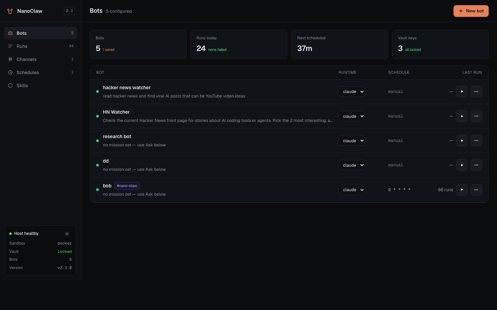
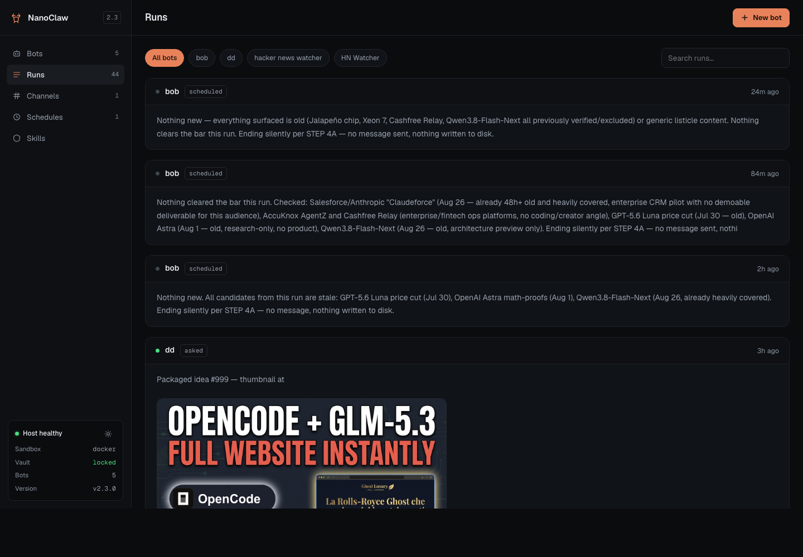
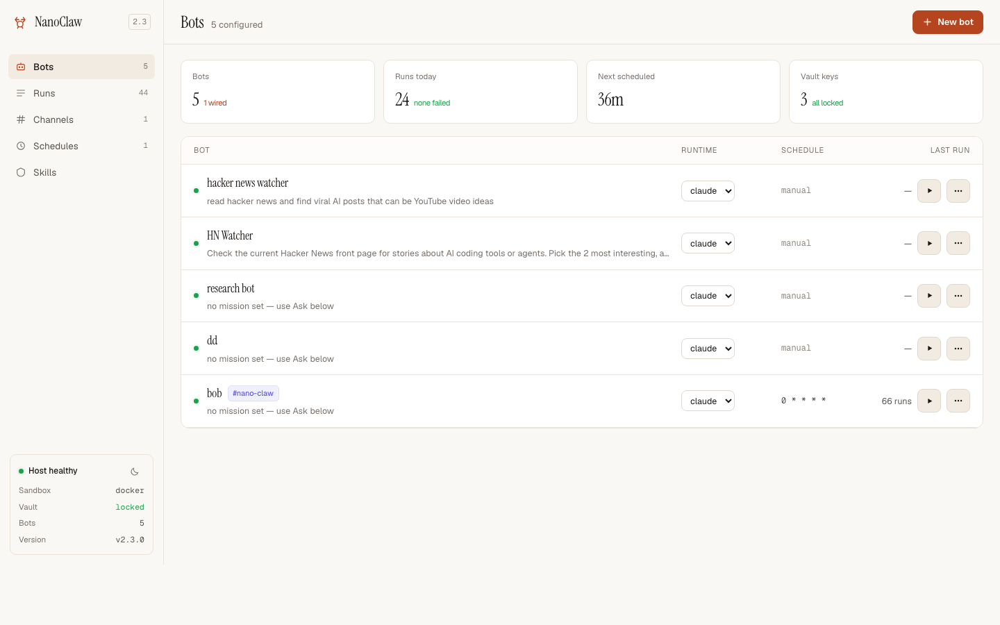

<p align="center">
  
</p>

<h1 align="center">NanoClaw Console</h1>

<p align="center">
  A web GUI for <a href="https://bit.ly/3UXV7wr">NanoClaw</a> — describe a bot in plain English, give it keys, run it, and read what it did. No terminal required.
</p>

<p align="center">
  <a href="https://bit.ly/3UXV7wr">nanoclaw.dev</a>&nbsp; • &nbsp;
  <a href="https://www.youtube.com/@incomestreamsurfers">YouTube</a>&nbsp; • &nbsp;
  <a href="tools/ui/README.md">console docs</a>&nbsp; • &nbsp;
  <a href="https://github.com/nanocoai/nanoclaw">upstream</a>
</p>

<p align="center">
  
</p>

---

## What this is

[NanoClaw](https://bit.ly/3UXV7wr) runs AI agents in their own Linux containers — properly
isolated, credentials never inside the sandbox. It is excellent, and it is driven
entirely from the command line.

This fork adds **a local web console** on top of it. Everything you can do in the
GUI is an `ncl` command underneath, so the UI adds no logic of its own and cannot
drift from the CLI. Everything upstream still works exactly as it did.

```bash
git clone https://github.com/IncomeStreamSurfer/nanoclaw.git
cd nanoclaw
pnpm install
pnpm run ui
```

Then open **http://127.0.0.1:7799**. Running it again replaces the instance
already on that port, so you never have to hunt one down.

You need a working NanoClaw install first (`bash nanoclaw.sh` handles that —
dependencies, sandbox image, vault, credentials, service). The console manages
whatever install its checkout sits in.

## What you get

**Build a bot by describing it.** Name it, write its mission in a sentence, paste
any API keys, optionally give it a schedule. It gets its own container, its own
memory and its own workspace.

**Secrets the bot never sees.** Give a key an *API host* and it goes into the
OneCLI vault — the gateway injects it into requests to that host, so the agent
calls the API with no key anywhere in its sandbox. Leave the host blank and it's
a plain setting instead. Prompt-injecting a key out of a bot doesn't work when
the key was never in the container.

**Run it and read the result in the page.** Hit ▶ and the mission runs in its
container; the report lands in the row. No Discord required — connect a channel
only if you want the bot reachable from chat.

<p align="center">
  
</p>

**A runs feed you can actually scroll.** Every run from every bot, newest first,
with the agent's markdown rendered properly — headings, lists, links, code, and
thumbnails the bot wrote to disk shown inline. Filter by bot or search the text.

**Skills, drag and drop.** Paste a GitHub URL or drop a `.zip` of a skill folder
onto a bot and it restarts with the skill installed. Skills are per-bot, so one
agent learning to scrape doesn't change any of the others.

**One-click updates.** The version row tells you when a new NanoClaw is out. The
updater tags a rollback point, merges, installs, builds, rebuilds the sandbox
image only if it needs to, restarts and verifies — rolling back on its own if the
build fails. Releases carrying `[BREAKING]` changes are shown to you rather than
applied silently, because those can need migrations a button can't make.

**Light and dark.** Toggle in the host box, bottom left.

<p align="center">
  
</p>

## Notes

- The console binds to `127.0.0.1` only, deliberately. It is the admin plane — it
  can add filesystem mounts, install skills and wire channels — so it is not
  something to expose. It has no auth, because it has no network surface.
- Zero dependencies and no build step: one Node file and one HTML file, shelling
  out to `bin/ncl --json`.
- `templates/iss/idea-scout/` is an example agent plugin — a YouTube channel
  manager. Stamp your own with `ncl groups create --template <ref>`.
- Full console documentation: [tools/ui/README.md](tools/ui/README.md).

## Credit

NanoClaw itself is by [qwibitai / nanocoai](https://github.com/nanocoai/nanoclaw) —
all of the hard parts (container isolation, the credential gateway, the agent
runtime, the `ncl` control plane) are theirs. This fork only adds a face for it.
Upstream's own README is kept at [README_upstream.md](README_upstream.md).
